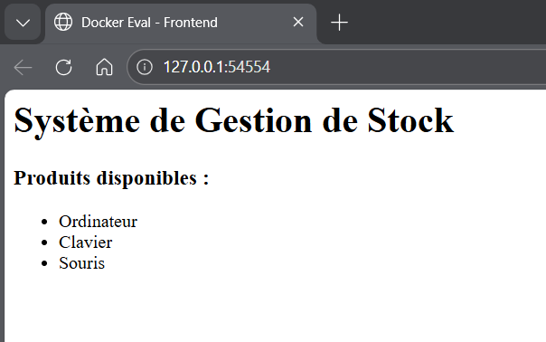
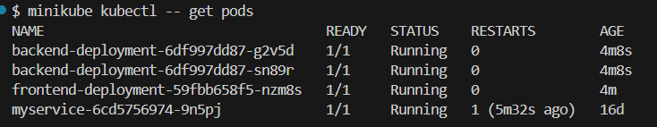
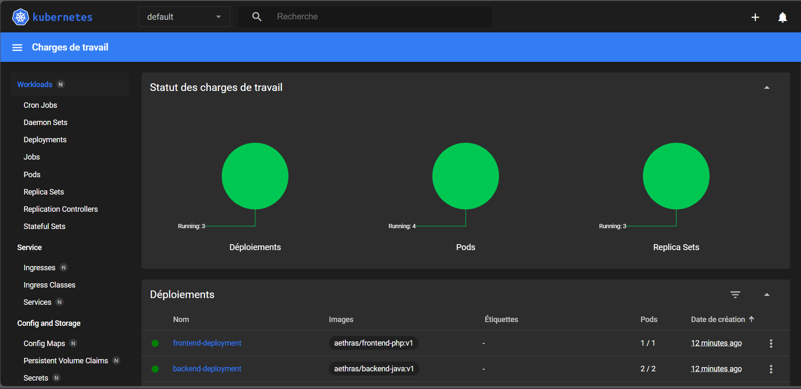
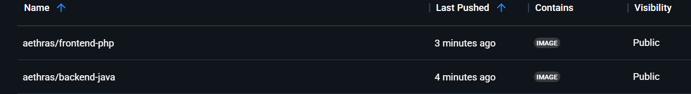

# Évaluation Gestion de Conteneurs

## Structure du projet
- `backend-java/` : API REST Spring Boot (Port 8080)
- `frontend-php/` : Interface Web PHP (Port 80)
- `k8s/` : Manifestes Kubernetes (Deployments & Services)

## Instructions de lancement (Kubernetes)
1. Démarrer le cluster : `minikube start`
2. Déployer les images : `kubectl apply -f k8s/`
3. Accéder à l'application : `minikube service frontend-service`

## Preuves de fonctionnement

### 1. Application en ligne (Interface Web)
L'application est accessible via le tunnel Minikube. Le frontend PHP récupère les données du backend Java.

### 2. État du cluster Kubernetes
Tous les services sont déployés avec succès sur le cluster local.

### 3. Dashboard Minikube
Vue d'ensemble de l'orchestration des conteneurs.

### 4. Les deux dépôts poussés en ligne sur Docker Hub
